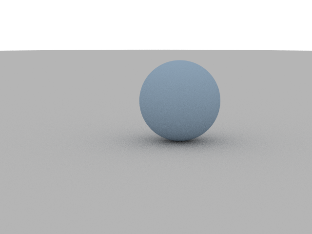
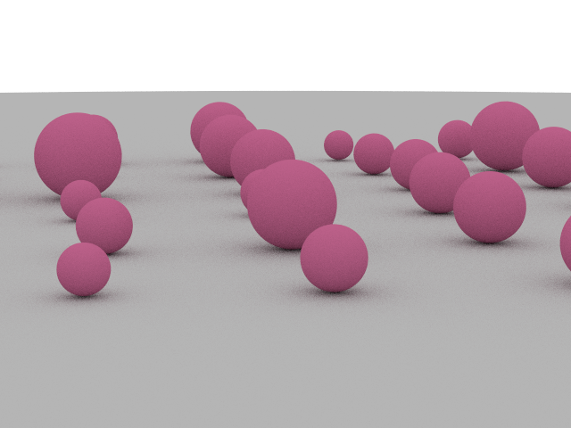
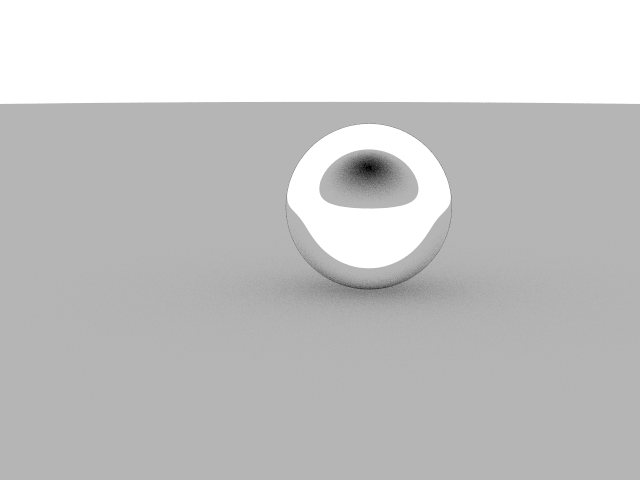
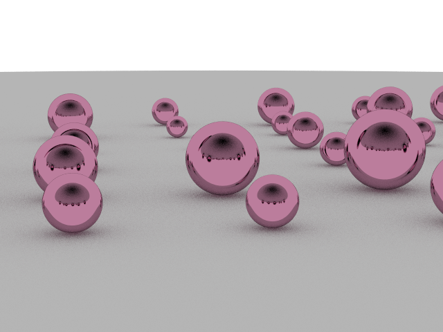
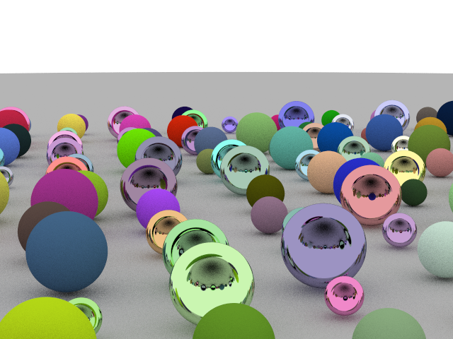

# PathTraceImages-RUST

Rust-based recreation of PT-ImGen.
- Fixed reflection calculations.

Five images are generated for Diffusion and Specular lighting.

## Diffusion Tests:

## Specular Lighting Tests:

## Diffusion and Specular Lighting:

  

